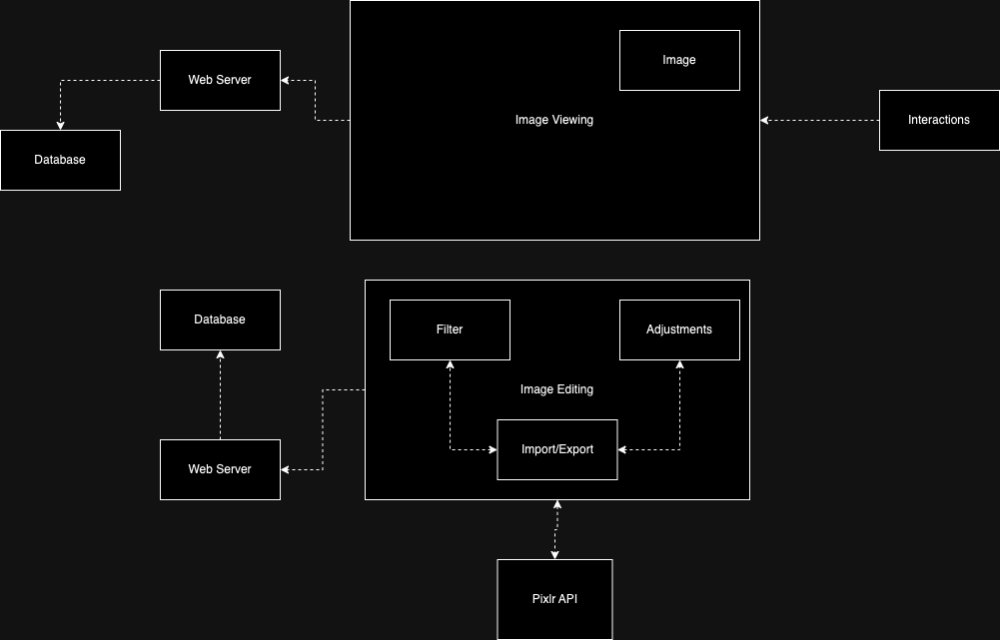
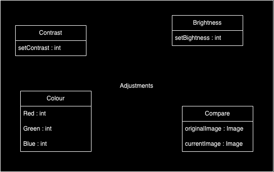
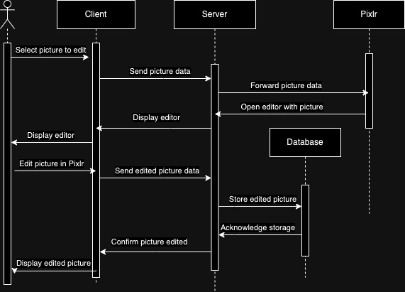
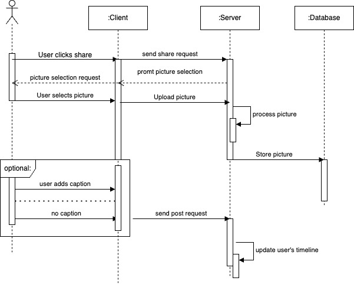

# **Documentation for PictureIt**

# 1. Introduction & Goals

**Requirements Overview**

- Posting & Viewing high quality images
- Customizable filters & Advanced editing tools with Pixlr integration 
- Commenting, Liking, Saving posts, Hashtags 
- User generated Challenges & Competitions 
- Free (limited) & Subscription based versions

**Stakeholders**

| Role/name    | Expectations |
| -------- | ------- |
| User (18-25 yo)  | View, share and interact with posts and other users   |
|Content Creator|Upload, edit photos to the app. Build a following|
|Advertisers|Advertise their product to a wide audience|
|Client|Have a successful and functional app with many user & creators|
|Investors|Platform growth. Return on investment|

**Quality Goals**

| Priority | Quality| Motivation | 
| -------- | ------- |-------|
|1|Meets Security and Privacy regulations|Keeping user’s data safe|
|2|IOS & Android availability|Largest possible target audience|
|3|No downtime - 24/7 availability|Enhance user experience.|

# 2. **Architecture Constraints**

|Constraints|Background and/or motivation|
|---|---|
|Data Consistency|Multiple databases have to be deployed, data might need to be sended between microservices|
|Security & Data Protection|Authorization and Authentification must be secure and can't be intercepted|
|Memory Friendly|The application cannot be too large|
|Deployable to IOS and Android|Wide Target audience|
|Resilient|A failure of one service should have minimal impact on other services|

# 3. **Context & Scope**

# 4. Solutions, Decisions and Risks

**Solutions Strategy**

|Goal/Requirement|Architectural Approach|
|----------------|----------------------|
|Image Sharing/Posting|Microservice|
|Image editing / filters / third party integration of pixlr|Microservice|
|Discovery algorithm (hashtags, likes, comments)|Microservice|

# 5. Building Block View

**Level 1**

**Level 2**

**Level 3**

# 6. Runtime View
**Sequence Diagram**

**Edit Photo**

**Post Photo**

# 7. Deployment View

**CAP Theorem**

**Consistency: This means that all nodes see the same data at the same time. In the context of PictureIt, consistency would mean that when a user posts a picture or makes a comment, all other users should be able to see that update immediately. However, due to the use of microservices and potential for multiple databases, there might be a risk of inconsistencies.**

**Availability: This means that every request receives a response, without guarantee that it contains the most recent version of the information. PictureIt aims for 24/7 availability, which is a key requirement for any social media application.**

**Partition Tolerance: This means that the system continues to operate despite arbitrary partitioning due to network failures. Given that PictureIt is a global application, it must be able to handle network partitions effectively.**

**PictureIt prioritizes Availability (A) and Partition Tolerance (P). It’s more important that the service remains available and can handle network issues, even if it means some users might not see the most up-to-date data immediately.**

.jpeg>)

# 8. Crosscutting Concepts

**Crosscutting Concepts**

-Development concepts

•Coding conventions (For easier and better documentation, easier to understand code)

•Error logs (For error fixing)

-Architecture and design patterns
•Internationalization (App must be accessible and user-friendly to a global audience, right to left capability)

-Safety and security concepts
•Privacy (location, email, passwords, real names)

**Decisions**

|Context|Decision|Consequence|
|---|---|---|
|Privacy|We will never store unencrypted userdata (passwords, location data, email, names)|A specific encryption must be used globally (hashes, etc), encryption will require time & resources|
|Retries and Timeout Strategy|We will address network failures by retrying service calls and implementing timeout strategies|Additional work must be done to implement these services|
|Database design|We will use a specific database language|We will have to implement our databases using only one language (PreSQL, Postgre, etc.)|

# 9. **Architecture Decisions**

|Problem|Considered Alternatives|Decision|
|---|---|---|
|Users want to post pictures in real time (1-2 seconds)|SOA: adaptive and flexible. Simpler implementation.|Microservices: SOA has issues with a sudden surge of users, we need a reliable and quick solution|
|Users want to see relevant posts|SOA: Algorithm can be updated and change without affecting the correct functioning of other services.|Microservices: Algorithm needs to quickly and dynamically adjust to user preferences through interactions (likes, comments, etc.)|
|User wants to see before & after versions of edited pictures|SOA: Saves images to database and exchanges requested data with user interface and third party services|Microservices: SOA would require many interactions with the database and be unresponsive|

# 10. Quality Requirements

**Quality goals & Scenarios**

Goal – Efficiency – Time behavior 
- A user uploads an image with an average internet connection. The post should be available within 2-4 seconds. 

Goal – Functionality - Security 
- A user creates an account, their user data is encrypted using at least AES 256bit encryption before being sent to the server and should not be accessed/decrypted by an outside attacker. 

Goal – Maintainability - Changeability 
- When there is an update to the third party Pixlr app. Developers must implement and update PictureIt within 3 hours.

**Quality Tree**

\\](<SWARQ - Quality.jpg>)\](<SWARQ - Quality (1).jpg>)](<SWARQ - Quality (3).jpg>)

# 11. **Risks and Technical Debt**

|Risk/Technical Debt|Description|
|---|---|
|Development costs|Microservices require a large team of developers to maintain, update and build the system|
|Data consistency|Microservices need to handle data independently which can lead to inconsistencies|
|Versioning|Microservices come with complex versioning due to all of the services, which can be a lot of work to update and maintain|

# **Glossary**

- Pixlr Integration: Pixlr is a cloud-based set of image tools and utilities, including a number of photo editors, a screen recorder browser extension, and a photo sharing service. In the context of PictureIt, Pixlr integration refers to the incorporation of Pixlr’s advanced editing tools into the PictureIt app.

- User generated Challenges & Competitions: These are contests or competitions created by users of the PictureIt app. They can be based on different themes or concepts and allow users to engage with each other by participating in these challenges.

- Microservices: Microservices - also known as the microservice architecture - is an architectural style that structures an application as a collection of services that are highly maintainable and testable, loosely coupled, independently deployable, organized around business capabilities, and owned by a small team.

- SOA: SOA stands for Service-Oriented Architecture. It is a style of software design where services are provided to the other components by application components, through a communication protocol over a network. The basic principles of service-oriented architecture are independent of vendors, products, and technologies.

- Data Consistency: This refers to the requirement that data must be consistent across all databases and microservices in the PictureIt app. This means that all users should see the same data at the same time.

- CAP Theorem: Also known as Brewer’s theorem, the CAP theorem states that it is impossible for a distributed data store to simultaneously provide more than two out of the following three guarantees: Consistency, Availability, and Partition tolerance. In the context of PictureIt, the app prioritizes Availability and Partition Tolerance.

- Crosscutting Concepts: These are concepts that apply across all the different sections of the PictureIt app. They include development concepts like coding conventions and error logs, architecture and design patterns like internationalization, and safety and security concepts like privacy.

- Internationalization: This is the process of designing and preparing your app to be usable in different languages. This includes translating text and components and may also involve changes in layout or even functionality, depending on the region and language.

- AES 256bit encryption: AES stands for Advanced Encryption Standard, and 256 refers to the key size. In this case, it means that the key used in the encryption process is 256 bits in size. It is used to encrypt user data before being sent to the server for added security.

- Efficiency – Time behavior: This refers to the performance goal of the PictureIt app. Specifically, it refers to the speed at which a user can upload an image with an average internet connection.

- Functionality - Security: This refers to the security measures implemented in the PictureIt app. For example, user data is encrypted using at least AES 256bit encryption before being sent to the server.

- Maintainability - Changeability: This refers to the ability of the PictureIt app to adapt to changes. For example, when there is an update to the third party Pixlr app, developers must implement and update PictureIt within 3 hours.

- Quality Tree: A quality tree is a diagram that helps to visualize the quality goals of a project. It can help to identify and prioritize quality attributes.

- Technical Debt: Technical debt is a concept in software development that reflects the implied cost of additional rework caused by choosing an easy solution now instead of using a better approach that would take longer.

- Versioning: This refers to the practice of assigning unique version numbers to unique states of the software. In the context of microservices, versioning can be complex due to the number of services involved.