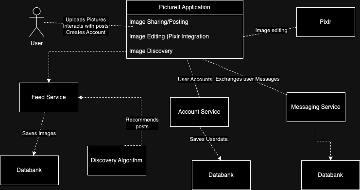

# 
**Documentation for PictureIt**

# Introduction & Goals

**Requirements Overview**

- Posting & Viewing high quality images
- Customizable filters & Advanced editing tools with Pixlr integration 
- Commenting, Liking, Saving posts, Hashtags 
- User generated Challenges & Competitions 
- Free (limited) & Subscription based versions

**Stakeholders**

| Role/name    | Expectations |
| -------- | ------- |
| User (18-25 yo)  | View, share and interact with posts and other users   |
|Content Creator|Upload, edit photos to the app. Build a following|
|Advertisers|Advertise their product to a wide audience|
|Client|Have a successful and functional app with many user & creators|
|Investors|Platform growth. Return on investment|

**Quality Goals**

| Priority | Quality| Motivation | 
| -------- | ------- |-------|
|1|Meets Security and Privacy regulations|Keeping user’s data safe|
|2|IOS & Android availability|Largest possible target audience|
|3|No downtime - 24/7 availability|Enhance user experience.|

# Solutions, Decisions and Risks

**Solutions Strategy**

|Goal/Requirement|Architectural Approach|
|----------------|----------------------|
|Image Sharing/Posting|Microservice|
|Image editing / filters / third party integration of pixlr|Microservice|
|Discovery algorithm (hashtags, likes, comments)|Microservice|

**Architecture Decisions**

|Problem|Considered Alternatives|Decision|
|---|---|---|
|Users want to post pictures in real time (1-2 seconds)|SOA: adaptive and flexible. Simpler implementation.|Microservices: SOA has issues with a sudden surge of users, we need a reliable and quick solution|
|Users want to see relevant posts|SOA: Algorithm can be updated and change without affecting the correct functioning of other services.|Microservices: Algorithm needs to quickly and dynamically adjust to user preferences through interactions (likes, comments, etc.)|
|User wants to see before & after versions of edited pictures|SOA: Saves images to database and exchanges requested data with user interface and third party services|Microservices: SOA would require many interactions with the database and be unresponsive|

**Risks and Technical Debt**

|Risk/Technical Debt|Description|
|---|---|
|Development costs|Microservices require a large team of developers to maintain, update and build the system|
|Data consistency|Microservices need to handle data independently which can lead to inconsistencies|
|Versioning|Microservices come with complex versioning due to all of the services, which can be a lot of work to update and maintain|

**Architecture Constraints**

|Constraints|Background and/or motivation|
|---|---|
|Data Consistency|Multiple databases have to be deployed, data might need to be sended between microservices|
|Security & Data Protection|Authorization and Authentification must be secure and can't be intercepted|
|Memory Friendly|The application cannot be too large|
|Deployable to IOS and Android|Wide Target audience|
|Resilient|A failure of one service should have minimal impact on other services|

**Context**

# Crosscutting Concepts

**Crosscutting Concepts**

-Development concepts

•Coding conventions (For easier and better documentation, easier to understand code)

•Error logs (For error fixing)

-Architecture and design patterns
•Internationalization (App must be accessible and user-friendly to a global audience, right to left capability)

-Safety and security concepts
•Privacy (location, email, passwords, real names)

**Decisions**

|Context|Decision|COnsequence|
|---|---|---|
|Privacy|We will never store unencrypted userdata (passwords, location data, email, names)|A specific encryption must be used globally (hashes, etc), encryption will require time & resources|
|Retries and Timeout Strategy|We will address network failures by retrying service calls and implementing timeout strategies|Additional work must be done to implement these services|
|Database design|We will use a specific database language|We will have to implement our databases using only one language (PreSQL, Postgre, etc.)|

# Quality

**Quality goals & Scenarios**

Goal – Efficiency – Time behavior 
- A user uploads an image with an average internet connection. The post should be available within 2-4 seconds. 

Goal – Functionality - Security 
- A user creates an account, their user data is encrypted before being sent to the server and should not be accessed/decrypted by an outside attacker. 

Goal – Maintainability - Changeability 
- When there is an update to the third party Pixlr app. Developers must implement and update PictureIt within 3 hours.

**Quality Tree**

\](<SWARQ - Quality.jpg>)](<SWARQ - Quality (1).jpg>)
